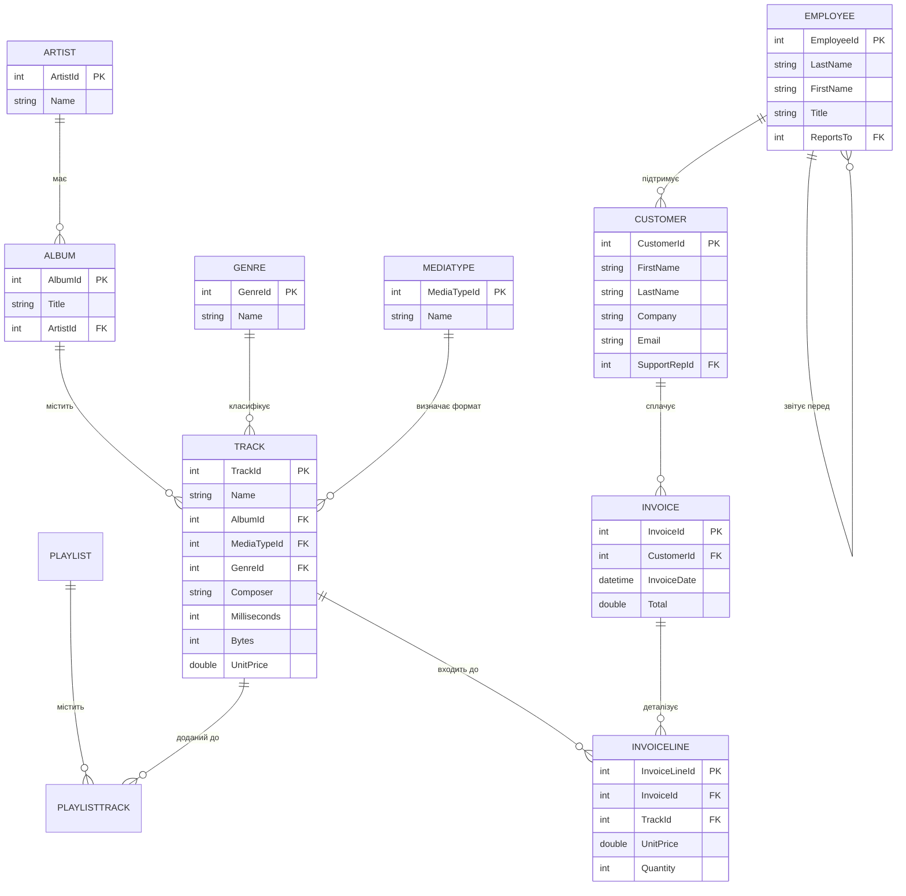

# Схема бази даних Chinook

```mermaid
erDiagram
    ARTIST ||--o{ ALBUM : "має"
    ALBUM ||--o{ TRACK : "містить"
    GENRE ||--o{ TRACK : "класифікує"
    MEDIATYPE ||--o{ TRACK : "визначає формат"
    TRACK ||--o{ INVOICELINE : "входить до"
    INVOICE ||--o{ INVOICELINE : "деталізує"
    CUSTOMER ||--o{ INVOICE : "сплачує"
    EMPLOYEE ||--o{ CUSTOMER : "підтримує"
    EMPLOYEE ||--o{ EMPLOYEE : "звітує перед"
    PLAYLIST ||--o{ PLAYLISTTRACK : "містить"
    TRACK ||--o{ PLAYLISTTRACK : "доданий до"

    ARTIST {
        int ArtistId PK
        string Name
    }
    ALBUM {
        int AlbumId PK
        string Title
        int ArtistId FK
    }
    TRACK {
        int TrackId PK
        string Name
        int AlbumId FK
        int MediaTypeId FK
        int GenreId FK
        string Composer
        int Milliseconds
        int Bytes
        double UnitPrice
    }
    GENRE {
        int GenreId PK
        string Name
    }
    MEDIATYPE {
        int MediaTypeId PK
        string Name
    }
    CUSTOMER {
        int CustomerId PK
        string FirstName
        string LastName
        string Company
        string Email
        int SupportRepId FK
    }
    INVOICE {
        int InvoiceId PK
        int CustomerId FK
        datetime InvoiceDate
        double Total
    }
    INVOICELINE {
        int InvoiceLineId PK
        int InvoiceId FK
        int TrackId FK
        double UnitPrice
        int Quantity
    }
    EMPLOYEE {
        int EmployeeId PK
        string LastName
        string FirstName
        string Title
        int ReportsTo FK
    }
```
